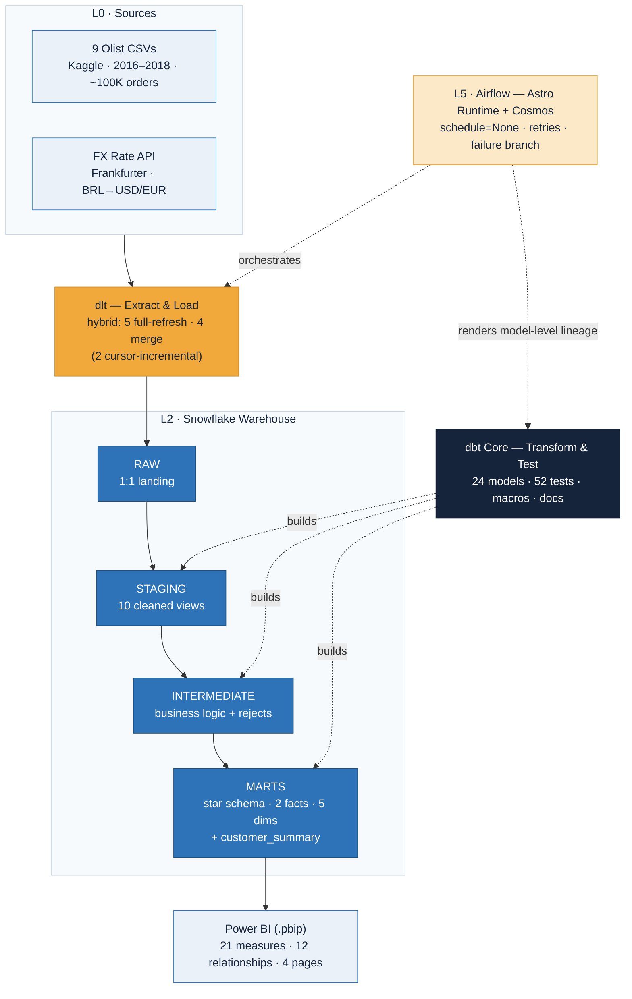
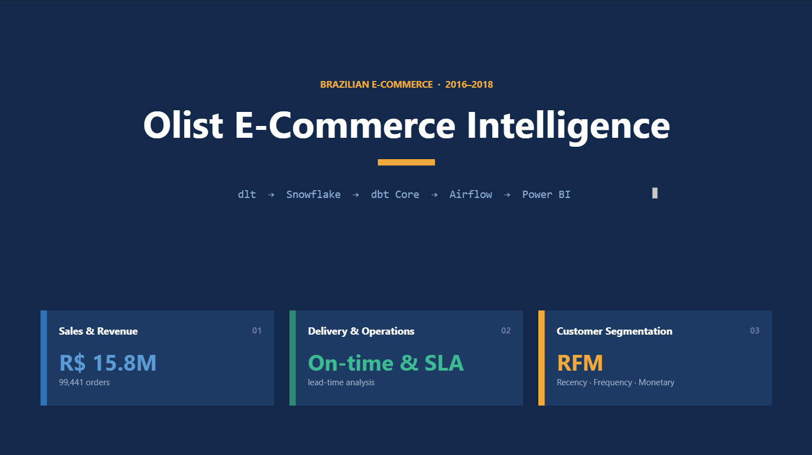
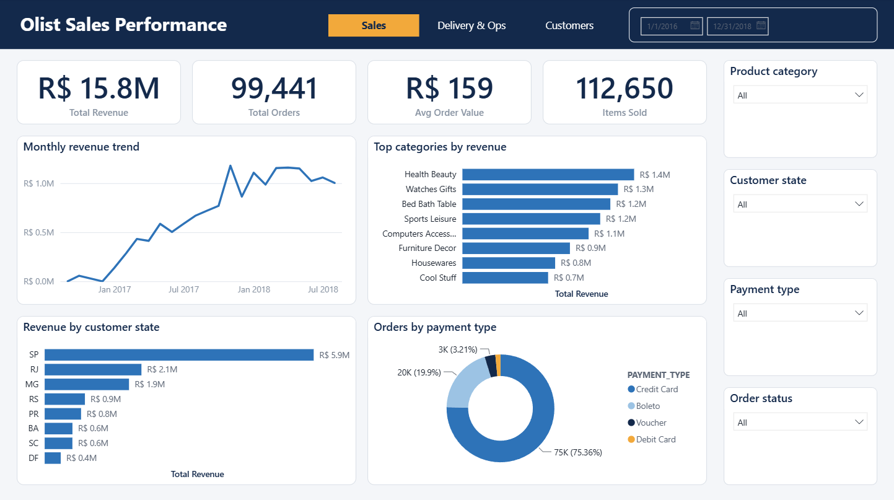
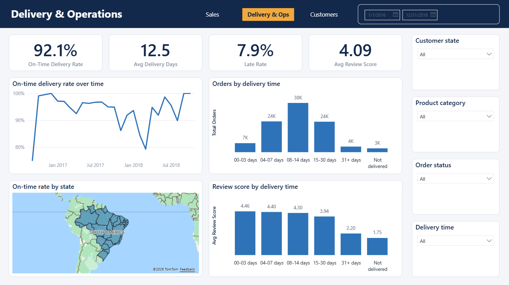
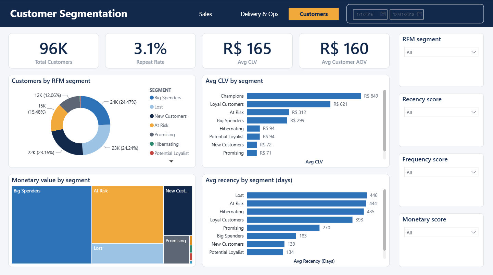
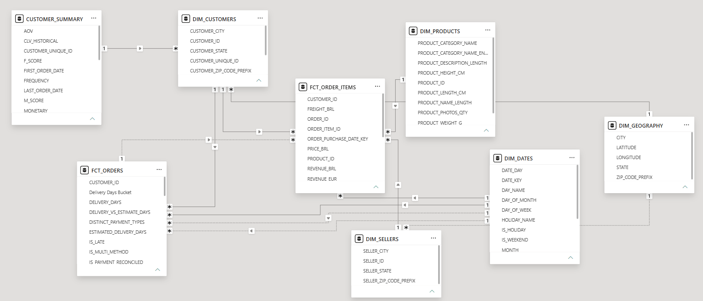
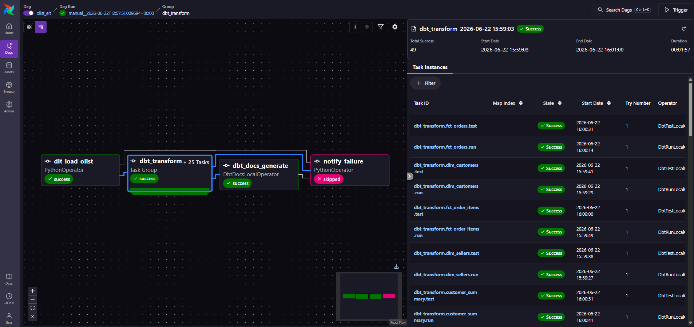
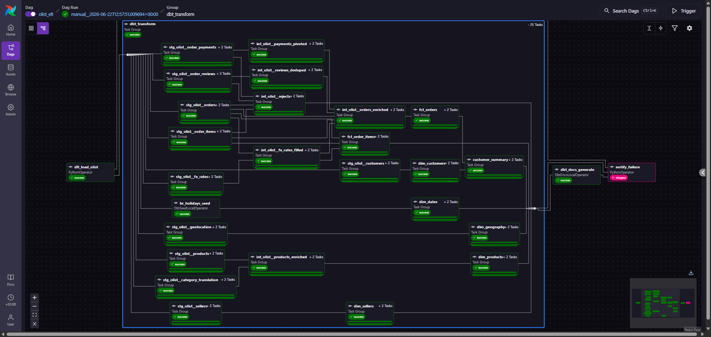

# Olist Analytics Engineering Warehouse
### A trustworthy ELT warehouse on Brazilian e-commerce data · dlt → Snowflake → dbt Core → Airflow → Power BI

[](https://www.linkedin.com/in/muhammad-umer-riaz/)
[](https://github.com/Muhammad-Umer-Riaz)
[](mailto:muhammad.umer2149@gmail.com)

---

## What This Is

An end-to-end **analytics-engineering** project on the real [Olist Brazilian e-commerce
dataset](https://www.kaggle.com/datasets/olistbr/brazilian-ecommerce): nine relational tables
of ~100K orders (2016–2018) flow through **dlt → Snowflake → dbt Core → Airflow** and surface
in a **Power BI** report authored as code. The pipeline lands raw data 1:1, cleans and conforms
it through a staging → intermediate → marts dbt layer into a two-fact star schema, enforces
correctness with 52 tests and an auditable rejects table, and is wired into a single observable
Airflow DAG.

It is a **depth-over-breadth** build — a deliberately focused stack rather than a sprawling
multi-source platform, with the effort spent on doing each layer well: dimensional modelling,
least-privilege warehouse access, idempotent loads, fan-trap-safe design, and auditable data
throughout. Most of the work lives in the warehouse, not the dashboard.

It is **spec-driven and ADR-heavy** by design, and built with **Claude Code as a pair
programmer**: every phase began with a documented design decision and ended with verified row
counts and test results. Every significant decision — spanning architecture, modelling, and data
quality, with the alternatives rejected — is logged in [`DECISIONS.md`](./DECISIONS.md) (18 ADRs).
If you want the *why* behind any choice below, it's recorded there.

---

## Business Context

[Olist](https://olist.com/) is a real Brazilian e-commerce platform connecting small and medium
merchants to the major marketplaces. The public dataset is a genuine relational extract — orders,
items, payments, reviews, customers, products, sellers, and geolocation — and it is messy,
multi-grain, and Portuguese-labelled.

Real data means modelling around real defects: **no currency dimension** (every value is in
Brazilian Real with no FX context), a **customer-identity trap** (`customer_id` is per-order, not
per-person), and **multi-grain transactional tables** (a payment can have many installment rows; an
order can have many items and more than one review). The warehouse resolves these into clean,
conformed sales-and-operations marts that an analyst can extend without rebuilding the pipeline.

---

## Architecture



Nine Olist CSVs and one external FX API are extract-and-loaded by **dlt** into Snowflake `RAW`
(landed strictly 1:1). **dbt Core** transforms `RAW → STAGING → INTERMEDIATE → MARTS`, building a
star schema of two fact tables, five conformed dimensions, and a person-grain customer-summary
model. **Airflow** (Astro Runtime, via the Cosmos integration) orchestrates the whole thing as one
DAG with model-level lineage — but never loads data itself; that separation is deliberate
([ADR-003](./DECISIONS.md)). **Power BI**, authored in the diff-able `.pbip` text format, reads
`MARTS` through a read-only reporter role.

---

## Key Results

### Sales
| KPI | Value |
|---|---|
| Total Revenue | R$ 15.8M |
| Total Orders | 99,441 |
| Avg Order Value | R$ 159 |
| Items Sold | 112,650 |

### Delivery & Operations
| KPI | Value |
|---|---|
| On-Time Delivery Rate | 92.1% |
| Avg Delivery Days | 12.5 |
| Late Rate | 7.9% |
| Avg Review Score | 4.09 / 5 |

### Customers
| KPI | Value |
|---|---|
| Unique Customers | 96,096 |
| Repeat Rate | 3.1% |
| Avg Historical CLV | R$ 165 |
| Avg Customer AOV | R$ 160 |

### Platform
| Metric | Value |
|---|---|
| dbt models · tests | 24 models · 52 tests (49 pass · 3 documented warn) |
| Semantic model | 2 facts · 5 dims · 1 summary · 12 relationships · 21 measures |
| Star-schema integrity | every fact-FK `relationships` test passes (no orphan keys) |
| End-to-end Airflow DAG | green in **3m 35s** · 52 task nodes (49 dbt via Cosmos) |

---

## Business Value

Engineering is the focus, but the warehouse is built to answer real sales-and-operations
questions. A few, paired with what the data shows:

- **Where does revenue concentrate?** Heavily in **São Paulo** (R$ 5.9M — ~37% of all revenue,
  ahead of Rio de Janeiro at R$ 2.1M), and across a long tail of categories led by **Health &
  Beauty, Watches & Gifts, and Bed/Bath/Table** (~R$ 1.2–1.4M each).
- **Is Olist reliable on delivery?** Yes — **92.1% on-time** at an average of **12.5 days**.
- **Does late delivery actually hurt reviews?** Sharply. Average review score falls monotonically
  with delivery time: **4.46** for orders delivered in 0–3 days, down to **2.20** at 31+ days and
  **1.75** for never-delivered orders — delivery performance is the dominant driver of satisfaction.
- **Why is repeat purchase so rare?** The **3.1% repeat rate** is the headline finding: Olist is a
  ~97% one-time-buyer marketplace. This isn't a data bug — it's a real property of the platform, and
  it directly shaped the RFM design (see *Limitations*).

---

## Dashboard

A four-page Power BI report, authored entirely in the `.pbip` text format (TMDL model + PBIR
report JSON) and version-controlled in this repo.

### Home

*Cover page: the ELT pipeline and the three analytical sections at a glance.*

### Sales & Revenue

*R$ 15.8M revenue across 99,441 orders. Monthly revenue trend (complete months), top categories
and states by revenue, and orders by payment type (credit card dominates at ~75%). Right-rail
slicers cross-filter the page.*

### Delivery & Operations

*92.1% on-time delivery. On-time rate over time, order volume and review score by delivery-time
bucket, and a filled choropleth of on-time rate by Brazilian state.*

### Customer Segmentation

*RFM segmentation across 96,096 customers. Segment distribution, average CLV and recency by
segment, and a monetary treemap. Champions lead on CLV (R$ 849).*

---

## Data Model

The star schema is the centre of the project — two fact tables at different grains, five conformed
dimensions, and a separate person-grain summary for customer analytics.



| Object | Grain | Rows | Notes |
|---|---|---|---|
| `fct_order_items` | one row per order line | 112,650 | revenue, freight, item-grain FX (USD/EUR) |
| `fct_orders` | one row per order | 99,441 | delivery, payment, review, 3 role-playing date keys |
| `customer_summary` | one row per person | 96,096 | RFM scores, AOV, historical CLV |
| `dim_customers` | per-order customer | 99,441 | carries `customer_unique_id` as the person link |
| `dim_products` | product | 32,951 | PT→EN category translation |
| `dim_sellers` | seller | 3,095 | zip FK to geography |
| `dim_geography` | zip prefix | 19,015 | conformed; lat/long + modal city/state |
| `dim_dates` | calendar day | 1,096 | 2016–2018 + Brazilian national holidays |

Three modelling decisions are worth calling out:

- **Two facts, not one** ([ADR-007](./DECISIONS.md)). Revenue lives at order-*item* grain; delivery,
  payment, and review live at *order* grain. Forcing them into a single fact would either fan out
  revenue or collapse delivery — so they are split, and a singular test asserts the two reconcile.
- **Two-layer customer grain** ([ADR-006](./DECISIONS.md)). `customer_id` is per-order; the real
  person is `customer_unique_id`. Facts join on `customer_id`; `dim_customers` carries the person
  key as a linking attribute; and all person-level RFM/CLV analytics live in `customer_summary`.
  Order-grain joins and person-grain analytics stay correctly separate.
- **Role-playing dates** ([ADR-016](./DECISIONS.md)). `fct_orders` carries purchase, delivered,
  and estimated-delivery date keys, all pointing at a single `dim_dates`. One relationship is
  active; the others are activated on demand in DAX via `USERELATIONSHIP`.

---

## Layer Overview

| Layer | Tool | Objects | Purpose |
|---|---|---|---|
| L1 Load | **dlt** | 9 Olist tables + FX → `RAW` | Extract-and-load, 1:1 landing, hybrid full-refresh / merge |
| L2 Warehouse | **Snowflake** | `RAW`·`STAGING`·`INTERMEDIATE`·`MARTS` | Least-privilege RBAC, two scoped service users |
| L3 Staging | **dbt** | 10 `stg_*` views | Cast, rename, one hard cleaning problem each |
| L3 Intermediate | **dbt** | business-logic views + macros | Grain collapses, FX gap-fill, reconciliation, rejects |
| L3 Marts | **dbt** | 2 facts · 5 dims · summary (tables) | The star schema |
| L4 Test & Docs | **dbt** | 52 tests + dbt docs | Generic, singular, and conditional tests; lineage |
| L5 Orchestrate | **Airflow** | 1 DAG, 52 task nodes | dlt load → Cosmos dbt run/test → docs, with a failure branch |
| L6 BI | **Power BI (.pbip)** | 21 measures · 4 pages | Reads `MARTS` via a read-only reporter role |

---

## Engineering Deep-Dives

### Load — dlt (L1)
dlt performs the extract-and-load; **Airflow never loads** ([ADR-003](./DECISIONS.md)). The strategy
is **hybrid** ([ADR-005](./DECISIONS.md), [ADR-013](./DECISIONS.md)): the five small reference/dimension
tables are full-refreshed; the four large transactional tables are merge-loaded for idempotency.
Of those four, only `orders` and `order_reviews` carry a real timestamp column, so they use true
`dlt.sources.incremental` **cursor** extraction; `order_items` and `order_payments` have no date
column and instead **merge on their composite primary key** — an honest choice that keeps `RAW`
strictly 1:1 rather than injecting a fake cursor. Incrementals are seeded in two passes (through
2017, then 2018 as the "new" batch) to exercise the merge path. The one external source, the
**Frankfurter** FX API (BRL→USD/EUR), is loaded the same way to fix the dataset's missing-currency
defect ([ADR-004](./DECISIONS.md)).

### Warehouse & Access — Snowflake (L2)
Access is **least-privilege and provable** ([ADR-012](./DECISIONS.md)), not aspirational. Two
functional roles back two `TYPE = SERVICE` users — a **loader** (writes `RAW`) and a **transformer**
(reads `RAW`, writes `STAGING`/`INTERMEDIATE`/`MARTS`, *cannot* write `RAW`) — with the denial
verified by a connection test, not assumed. Service users authenticate by **key-pair** (private keys
gitignored; public keys committed in `snowflake/setup.sql`). DDL is **role-switched** so each object
is created by the role that should own it, and a resource monitor caps the warehouse at 30
credits/month. The reporting connection adds a third read-only role (`OLIST_REPORTER`) scoped to
`MARTS` only.

### Transformation — dbt Core (L3)
The transformation layer is where the real work lives, structured as **staging → intermediate →
marts**:

- **Staging** ([ADR-014](./DECISIONS.md)): 10 views, each solving one hard problem — fail-fast
  `timestamp_ntz` casts, light-touch renames, and the **geolocation collapse** from **1,000,163 raw
  rows to 19,015** one-row-per-zip records (median coordinates + a *deterministic* modal city/state,
  not a non-deterministic `MODE()`).
- **Intermediate** ([ADR-015](./DECISIONS.md)): reusable macros (`delivery_days`, `is_late`,
  `order_item_revenue`, `brl_to`), payment-installment collapse to one row per order, multi-review
  dedup, the deferred PT→EN category join, and an **FX gap-fill** (LOCF forward-fill + leading
  back-fill, since the FX API has no weekend/holiday rates).
- **Trust** ([ADR-009](./DECISIONS.md)): payment reconciliation is **3-state** (`TRUE`/`FALSE`/`NULL`
  when not assessable) — discrepancies are *flagged and kept* because most are legitimate credit-card
  financing, not errors. Genuinely-broken rows (orphan keys, structurally-missing payments) are
  quarantined into an **auditable `rejects` table** with a reason column — never silently dropped.

### Testing & Trust — dbt (L4)
**52 tests: 49 pass, 3 documented warn, 0 error.** Generic tests (unique, not_null, relationships,
accepted_values) cover every layer; singular tests assert business invariants (no negative money,
delivered-after-purchase, the two facts reconcile, delivered orders have a delivery date). The
known Olist source anomalies — 8 orders flagged delivered with no customer-delivery timestamp, and
a handful of zip codes absent from geolocation — are surfaced at **warn severity** rather than
hidden or dropped. Trustworthy, auditable data is the project's DNA.

### Orchestration — Airflow (L5)
One DAG (`olist_elt`) wires the platform together ([ADR-017](./DECISIONS.md)). dbt runs through
**astronomer-cosmos**, which renders the project as one Airflow task per model — giving
**model-level lineage** in the UI rather than a single opaque `dbt build` step. Dependency conflicts
between dbt, dlt, and Airflow are isolated into separate baked-in virtual environments;
credentials are two Airflow **Connections** that carry the same least-privilege boundary into the
orchestrator. `schedule=None` (the source is a static dump — see *Limitations*), `retries=2`, and an
explicit `notify_failure` branch on `one_failed`.


*The full DAG: `dlt_load_olist` → a Cosmos dbt task group (model-level run + test) → `dbt_docs_generate`, with a failure branch.*


*Cosmos expands dbt into per-model run/test tasks — staging → intermediate → marts lineage, visible in Airflow.*

### BI as Code — Power BI `.pbip` (L6)
The report is authored in the **`.pbip` (Power BI Project) text format** ([ADR-011](./DECISIONS.md)):
a TMDL semantic model and PBIR report JSON, both plain-text, diff-able, and version-controlled —
rather than an opaque binary `.pbix`. This keeps the everything-as-code, auditable story intact all
the way to the dashboard. The semantic model has 21 measures and 12 relationships (including the
role-playing date relationships and the geography snowflake).

The model and report were authored **as code** with [`pbi-cli`](https://github.com/MinaSaad1/pbi-cli)
— a CLI that drives Power BI's Tabular Object Model and edits the PBIR report JSON directly — driven
by Claude Code, so measures, relationships, and visuals were written and reviewed as text diffs
rather than clicked together in the Desktop GUI.

---

## Project Structure

```
├── dlt/
│   └── load_olist.py            # dlt pipeline: 9 Olist tables + Frankfurter FX → RAW (hybrid load)
├── snowflake/
│   ├── setup.sql                # warehouse, db, schemas, roles, service users, grants (role-switched)
│   └── verify_connection.py     # proves least-privilege (transformer denied RAW)
├── dbt/
│   ├── models/
│   │   ├── staging/olist/       # 10 stg_olist__* views (1:1 cleaned)
│   │   ├── intermediate/        # business logic, FX gap-fill, reconciliation, rejects
│   │   └── marts/               # 2 facts · 5 dims · customer_summary (star schema)
│   ├── macros/                  # delivery_days, is_late, brl_to, rfm_bucket, aov, …
│   ├── tests/                   # singular tests (reconciliation, no-negative-money, …)
│   └── seeds/                   # Brazilian national-holiday calendar
├── airflow/
│   ├── dags/olist_elt.py        # the orchestration DAG (Cosmos dbt task group)
│   └── Dockerfile               # isolated dbt_venv + dlt_venv
├── OlistAnalytics.pbip          # Power BI project (open this, not a .pbix)
├── OlistAnalytics.SemanticModel # TMDL model (tables, measures, relationships)
├── OlistAnalytics.Report        # PBIR report (4 pages, as code)
├── figures/                     # architecture, dbt lineage, Airflow, dashboard screenshots
├── plans/                       # per-phase build plans
├── CONTEXT.md                   # full project spec + locked decisions
├── DECISIONS.md                 # 18 ADRs (rationale + rejected alternatives)
└── PROGRESS.md                  # phase-by-phase build log
```

---

## Limitations

These are real constraints, stated honestly:

- **Static historical dump.** The Olist data is a fixed 2016–2018 extract. The incremental-load
  setup demonstrates the *mechanism* (cursor extraction, idempotent merge, two-pass seeding), not a
  response to genuinely arriving data. And only **2 of the 4** transactional tables carry a true
  timestamp cursor — the other two have no date column and merge on their primary key instead.
- **FX is forward-filled.** The Frankfurter API has no weekend/holiday rates, so BRL→USD/EUR
  conversion uses last-observation-carried-forward (plus a leading back-fill). Conversions on
  non-trading days are therefore approximate.
- **One-time-buyer skew.** Olist is ~97% one-time buyers (a 3.1% repeat rate), which makes Frequency
  a degenerate signal. RFM scores Frequency by value rather than by quantile (an NTILE quintile
  would mislabel one-time buyers as "Loyal"), the segmentation leans on Recency and Monetary, and
  CLV is **historical, not predictive** — and labelled as such.
- **Source anomalies are surfaced, not hidden.** 8 orders marked delivered without a delivery
  timestamp, and a few zip codes missing from geolocation, are kept visible at warn severity rather
  than quarantined — consistent with the auditable-data policy.
- **Power BI is local-only.** The report is built and viewed in Power BI Desktop and committed as
  `.pbip` + screenshots; it is **not** published to the Power BI Service (no hosted link). The
  reporting role authenticates by password (the loader/transformer use key-pair); the read-only
  `MARTS` scoping is unchanged.

---

## Reproducing This Project

This is a full data-stack build, so reproduction is honest about its prerequisites — it is not a
one-click clone. The committed artifacts (setup SQL, dlt/dbt projects, the DAG, the `.pbip`, and the
per-phase [`plans/`](./plans)) are the durable record.

**Prerequisites**
- A **Snowflake** account (a free trial works)
- The **Olist dataset** from [Kaggle](https://www.kaggle.com/datasets/olistbr/brazilian-ecommerce) → `data/raw/`
- **Python 3.12**
- **Astro CLI + Docker** (for the Airflow layer)
- **Power BI Desktop** on Windows (for the BI layer)

**Steps**
1. Run `snowflake/setup.sql` in Snowflake (creates the warehouse, database, schemas, roles, and
   service users). Generate key-pairs and register the public keys as documented in `.keys/README.md`.
2. `pip install -r requirements.txt`, then `python dlt/load_olist.py` to land `RAW` (both seed passes).
3. `cd dbt && dbt build --profiles-dir .` to build and test `STAGING → INTERMEDIATE → MARTS`.
4. *(Optional, for orchestration)* `cd airflow && astro dev start`, then trigger the `olist_elt` DAG.
5. Open `OlistAnalytics.pbip` in Power BI Desktop, point the Snowflake connection at your account,
   and refresh.

---

## Project Documentation

- [`CONTEXT.md`](./CONTEXT.md) — the full project spec and locked decisions
- [`DECISIONS.md`](./DECISIONS.md) — 18 ADRs, each with rationale and rejected alternatives
- [`PROGRESS.md`](./PROGRESS.md) — the phase-by-phase build log with verification results
- [`plans/`](./plans) — the per-phase implementation plans

---

## Author

**Muhammad Umer Riaz**
Analytics Engineering · Data Modelling 

[](https://www.linkedin.com/in/muhammad-umer-riaz/)
[](https://github.com/Muhammad-Umer-Riaz)
[](mailto:muhammad.umer2149@gmail.com)
